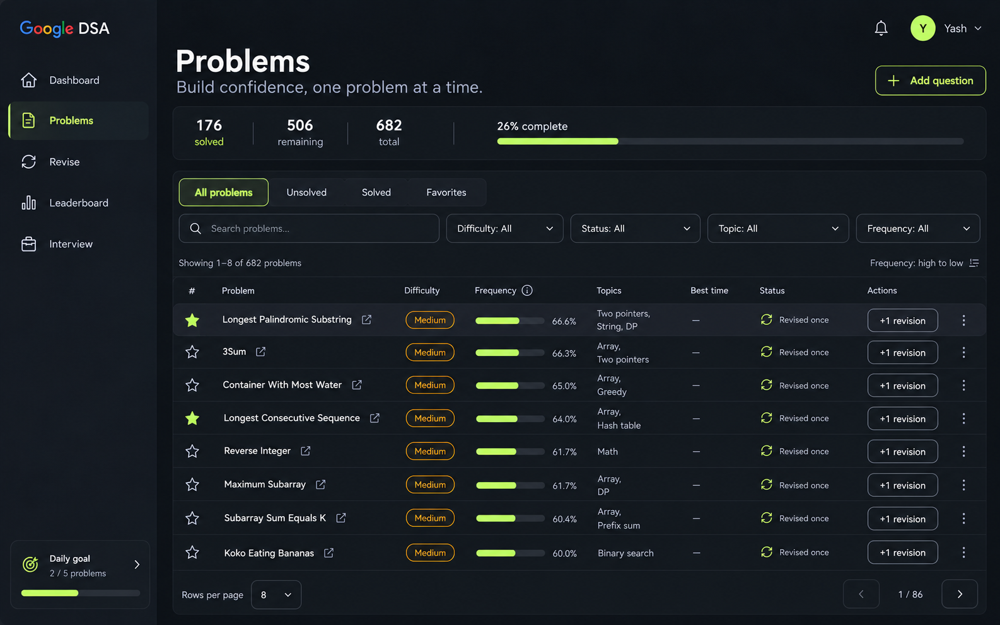
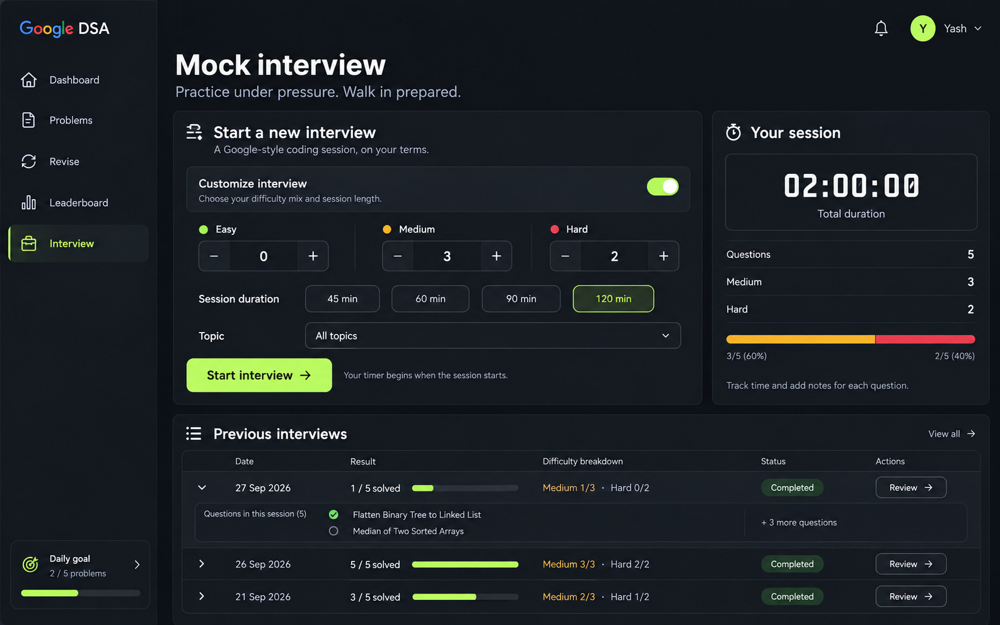

# Obsidian — Problems and Interview

Generated with the built-in image generation tool, using 01-obsidian.png as the visual reference. Static concepts; controls and displayed data are illustrative.

## Obsidian · Problems

### Prompt

Use case: ui-mockup. Generate a polished high-resolution landscape 16:10 desktop web application screen for Google DSA. Input image 1 is the APPROVED OBSIDIAN DESIGN LANGUAGE REFERENCE. Reproduce its exact visual system and shared app shell: graphite nearly-black background, charcoal slightly raised panels, fine gray borders, restrained bright lime #C2F970 primary actions and selected navigation, white headings, readable cool gray secondary text, amber outlined Medium badges, red outlined Hard badges, simple thin line icons, 12px rounded corners, compact professional sans serif typography. Match reference left sidebar width ~240px at 1600px canvas, logo Google DSA, sidebar Dashboard / Problems / Revise / Leaderboard / Interview, bottom daily goal card, and upper-right notification icon, lime Y avatar, Yash dropdown. This is another page OF THE SAME APPLICATION, not a new visual theme. Full front-facing UI only, no browser/device frame, no perspective, no concept board titles, no watermark. Premium functional software with clear hierarchy and full readable problem names, exact alignment, purposeful spacing. Avoid big empty areas, ornamental graphics, excessive gradients, duplicated navigation, small faint text, meaningless icons or invented AI features.
Page: PROBLEMS, selected in the sidebar; Dashboard is inactive. Main title "Problems", subtitle "Build confidence, one problem at a time." Top right outline "＋ Add question" button. Under heading a quiet inline progress summary "176 solved" · "506 remaining" · "682 total" and a fine progress line labeled "26% complete". The dominant page content is one wide beautifully composed problem library table occupying most of usable area; no distracting right rail.
Above table: segmented tabs "All problems" selected, "Unsolved", "Solved", "Favorites". Next row generously wide search field "Search problems..." followed by three compact dropdowns "Difficulty", "Status", "Topic" and smaller "Frequency %" filter; align cleanly. Subline "Showing 1–8 of 682 problems" on left and "Frequency: high to low" on right.
Table columns: a small favorite star, Problem, Difficulty, Frequency, Topics, Best time, Status, Actions. Allocate widest column to Problem so most titles fit on one line, at most two. Rows height about 68px. Frequency values have tiny lime horizontal bars and numerical percentages. Topic text wraps neatly to two short lines. Best time is monospace. Status uses text and subtle small icons. Actions include compact outline "+1 revision" and a quiet three-dot overflow for Reset, and a solved check control; show a slim external-link arrow beside problem title instead of another big button. No solid lime action repeated on every row.
Exact visible row data:
Longest Palindromic Substring | Medium | 66.6% | Two pointers, String, DP | — | Revised once.
3Sum | Medium | 66.3% | Array, Two pointers | — | Revised once.
Container With Most Water | Medium | 65.0% | Array, Greedy | — | Revised once.
Longest Consecutive Sequence | Medium | 64.0% | Array, Hash table | — | Revised once.
Reverse Integer | Medium | 61.7% | Math | — | Revised once.
Maximum Subarray | Medium | 61.7% | Array, DP | — | Revised once.
Subarray Sum Equals K | Medium | 60.4% | Array, Prefix sum | — | Revised once.
Koko Eating Bananas | Medium | 60.0% | Binary search | — | Revised once.
Favorite stars on first and fourth rows lime filled, others outline. Subtle highlighted hover state on first row. Bottom pagination "Rows per page  8" and "1 / 86", previous and next arrow controls. Render a beautiful usable dense problem-management page with the exact Obsidian visual personality.

## Obsidian · Interview

### Prompt

Use case: ui-mockup. Generate a polished high-resolution landscape 16:10 desktop web application screen for Google DSA. Input image 1 is the APPROVED OBSIDIAN DESIGN LANGUAGE REFERENCE. Reproduce its exact visual system and shared app shell: graphite nearly-black background, charcoal slightly raised panels, fine gray borders, restrained bright lime #C2F970 primary actions and selected navigation, white headings, readable cool gray secondary text, amber outlined Medium badges, red outlined Hard badges, simple thin line icons, 12px rounded corners, compact professional sans serif typography. Match reference left sidebar width ~240px at 1600px canvas, logo Google DSA, sidebar Dashboard / Problems / Revise / Leaderboard / Interview, bottom daily goal card, and upper-right notification icon, lime Y avatar, Yash dropdown. This is another page OF THE SAME APPLICATION, not a new visual theme. Full front-facing UI only, no browser/device frame, no perspective, no concept board titles, no watermark. Premium functional software with clear hierarchy and full readable problem names, exact alignment, purposeful spacing. Avoid big empty areas, ornamental graphics, excessive gradients, duplicated navigation, small faint text, meaningless icons or invented AI features.
Page: INTERVIEW home/setup page, selected in sidebar; Dashboard inactive. Main title "Mock interview", subtitle "Practice under pressure. Walk in prepared." Main area two columns top: wide session configuration panel taking 65% and narrower restrained session summary panel taking 35%. Bottom spanning whole main width is past interviews.
Wide top panel heading "Start a new interview", small caption "A Google-style coding session, on your terms." A full-width understated selection row "Customize interview" with toggle visibly ON, explanatory text "Choose your difficulty mix and session length." Below, clean 3-column numeric stepper controls "Easy" value 0, "Medium" value 3, "Hard" value 2. Difficulty colors are green/amber/red but accent chrome stays lime. Duration selection segmented "45 min" "60 min" "90 min" "120 min" with 120 min selected in lime-tinted outlined state. Small topic dropdown "All topics". Bottom left strong lime "Start interview →" primary button and quiet line "Your timer begins when the session starts." Avoid making the form unnecessarily complex.
Right top summary card "Your session" with small stopwatch icon, oversized clean monospace "02:00:00", caption "Total duration". Neatly divided rows: "Questions  5", "Medium  3", "Hard  2", then restrained amber/red 3/2 proportion bar and small secondary caption "Track time and add notes for each question." No invented readiness score or success forecast. Timer must clearly read as setup duration rather than active countdown.
Bottom panel heading "Previous interviews" with a small "View all →". Elegant compact history table columns "Date", "Result", "Difficulty breakdown", "Status", action. Three rows:
"27 Sep 2026" | "1 / 5 solved" | "Medium 1/3 · Hard 0/2" | "Completed" | "Review →".
"26 Sep 2026" | "5 / 5 solved" | "Medium 3/3 · Hard 2/2" | "Completed" | "Review →".
"21 Sep 2026" | "3 / 5 solved" | "Medium 2/3 · Hard 1/2" | "Completed" | "Review →".
Use elegant short result bars and muted completed badges, not busy pill soup. Second row 5/5 gets restrained lime highlight. Include one expanded history detail under first row, with "Flatten Binary Tree to Linked List" and "Median of Two Sorted Arrays" as compact text to indicate inspectable sessions. Fit whole screen gracefully, prioritize readable controls and consistent premium Obsidian styling.

