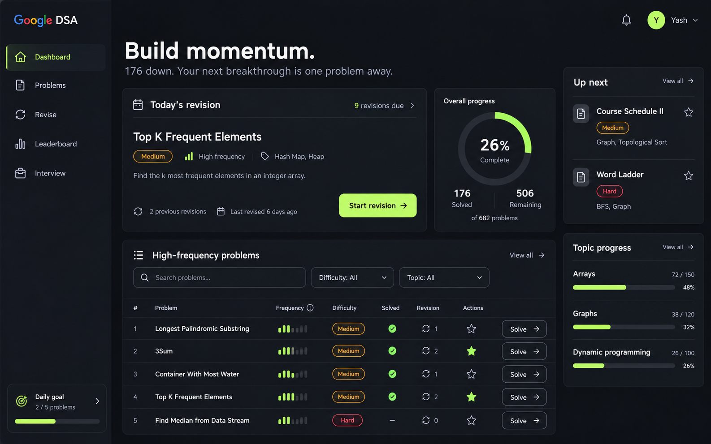
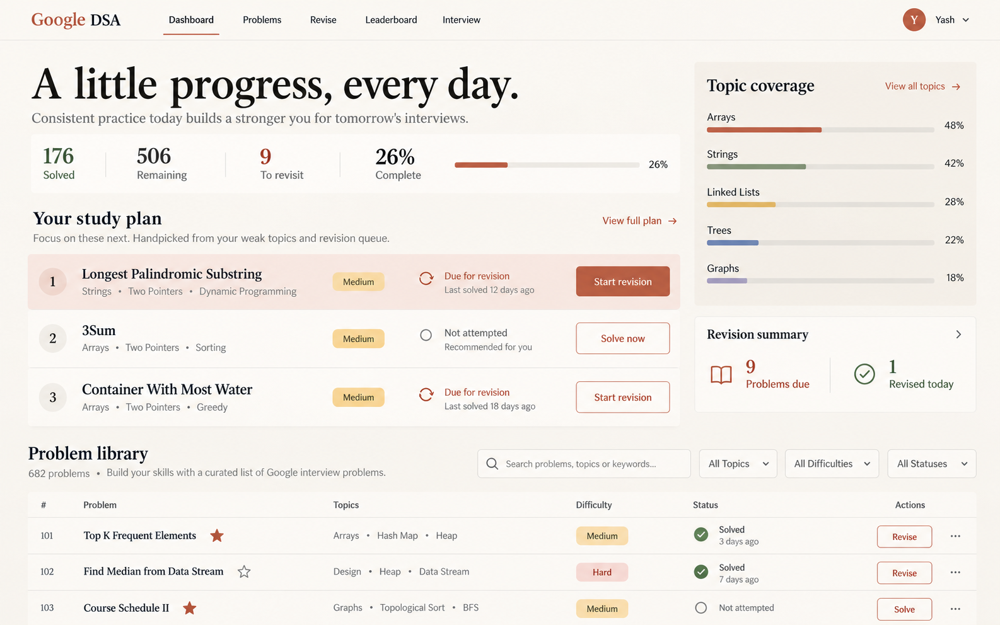
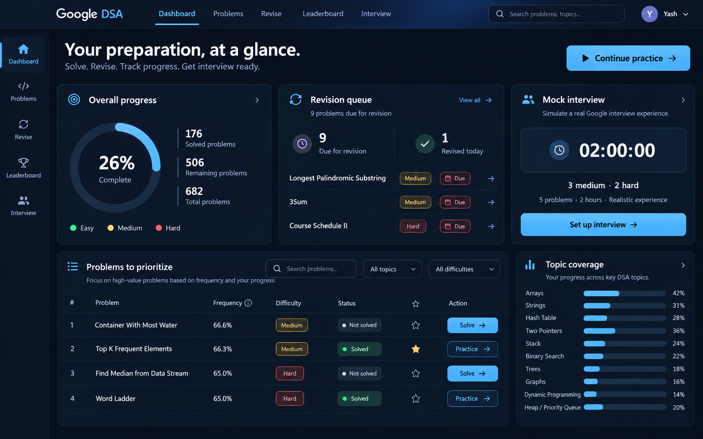
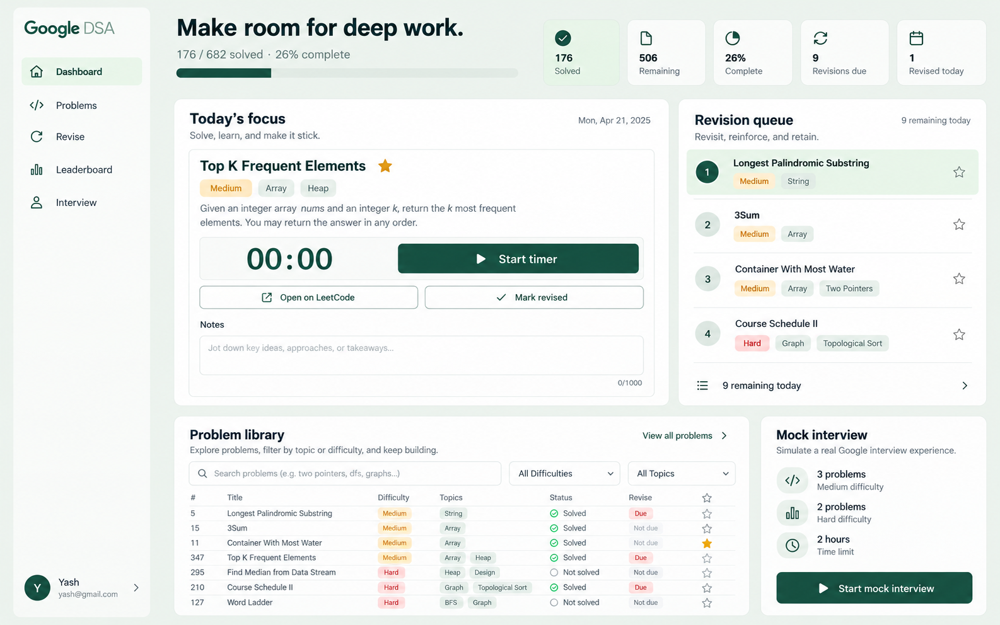
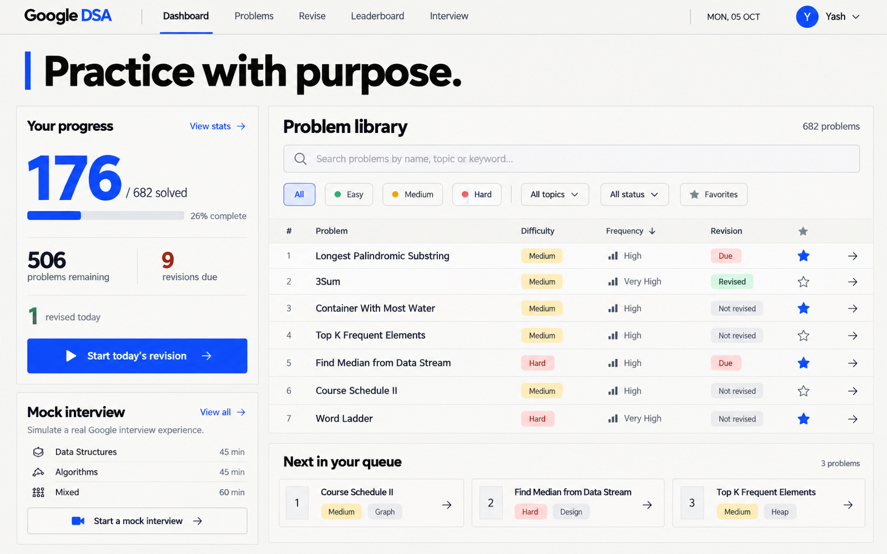
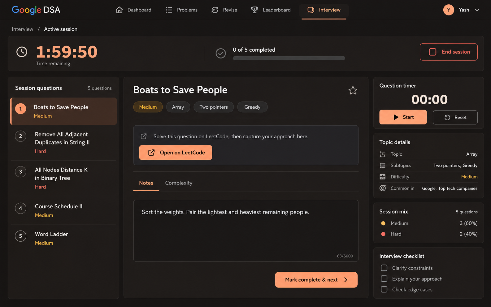

# Google DSA — six UI concepts

Created with the built-in image generation tool on 5 October 2026. Static visual concepts, not implemented screens. Additional statistics, dates, difficulty labels and proposed controls are illustrative and must be reconciled with real application data before implementation.

## 01 · Obsidian

### Generation prompt

Use case: ui-mockup. Create one extremely polished, modern, functional desktop web application UI render for the user's existing Google DSA interview preparation tracker. This is a design concept, not a marketing landing page. Flat front-facing screen, landscape 16:10, high-resolution crisp typography, no device frame, no browser chrome, no perspective, no watermarks. Brand text "Google DSA". Existing navigation: Dashboard, Problems, Revise, Leaderboard, Interview. User first name Yash, avatar Y. Keep realistic controls, legible hierarchy, generous but purposeful spacing, aligned grids, accessible contrast. Existing product facts: 176 solved of 682 problems, 506 remaining, 26% complete, 9 revisions due, 1 revised today. Actual example problem names: Longest Palindromic Substring, 3Sum, Container With Most Water, Top K Frequent Elements, Find Median from Data Stream, Course Schedule II, Word Ladder. Functional controls should include search, difficulty and topic filters where appropriate, favorite stars, difficulty labels, revision status, and an obvious primary action. Avoid unreadable low contrast, huge empty margins, decorative 3D objects, unrelated illustrations, fantasy charts, crowded excessive pills, giant gradients, invented AI features. Make this look like a carefully art-directed premium software product that can actually be built.
Direction: OBSIDIAN. Premium precise dark productivity workspace. Graphite #111318 canvas, charcoal layered panels, restrained electric lime #C2F970 accents, soft white text. Narrow left sidebar with simple line icons; brand at top, navigation below, small daily goal panel bottom. Main dashboard heading "Build momentum." and subdued subtitle "176 down. Your next breakthrough is one problem away." Upper area is asymmetric: wide focused card "Today's revision" with Top K Frequent Elements, Medium, 2 previous revisions and lime "Start revision" button; adjacent beautiful thin progress ring showing 26% with solved/remaining counts. Bottom main area wide compact problem table headed "High-frequency problems" with search and difficulty filter, 5 real problems, frequency miniature bars, difficulty and solved/revision icons. Right narrow rail "Up next" listing Course Schedule II and Word Ladder, and small topic progress bars labeled Arrays, Graphs, Dynamic programming. Clear baseline grid, minimal rounded corners 12px, excellent whitespace, visually refined, dense enough for daily use. Render only the UI, do not label it with the concept name.

## 02 · Paper

### Generation prompt

Use case: ui-mockup. Create one extremely polished, modern, functional desktop web application UI render for the user's existing Google DSA interview preparation tracker. This is a design concept, not a marketing landing page. Flat front-facing screen, landscape 16:10, high-resolution crisp typography, no device frame, no browser chrome, no perspective, no watermarks. Brand text "Google DSA". Existing navigation: Dashboard, Problems, Revise, Leaderboard, Interview. User first name Yash, avatar Y. Keep realistic controls, legible hierarchy, generous but purposeful spacing, aligned grids, accessible contrast. Existing product facts: 176 solved of 682 problems, 506 remaining, 26% complete, 9 revisions due, 1 revised today. Actual example problem names: Longest Palindromic Substring, 3Sum, Container With Most Water, Top K Frequent Elements, Find Median from Data Stream, Course Schedule II, Word Ladder. Functional controls should include search, difficulty and topic filters where appropriate, favorite stars, difficulty labels, revision status, and an obvious primary action. Avoid unreadable low contrast, huge empty margins, decorative 3D objects, unrelated illustrations, fantasy charts, crowded excessive pills, giant gradients, invented AI features. Make this look like a carefully art-directed premium software product that can actually be built.
Direction: PAPER. Warm editorial minimalism, ivory #F6F3EC canvas, white surfaces, deep ink #252824, muted terracotta #BD5B42 primary actions. Visually completely different from a typical dark dashboard: slim horizontal top navigation with small brand and right profile, generous content width. Large elegant serif heading "A little progress, every day." with clean sans-serif rest of UI. Below heading a horizontal numerical progress band: 176 solved, 506 remaining, 9 to revisit, a thin 26% completion line. Main content in 2 unequal columns: left wide "Your study plan" list styled like a refined paper checklist with three large numbered problem rows, real problem names, topics, difficulty, compact outline actions; first row softly highlighted terracotta with "Start revision". Right column a subtle cream panel with "Topic coverage" and five clean thin horizontal progress bars with muted earth colors. Bottom a well-aligned compact "Problem library" preview with search, topic tabs and 3 rows, understated separators, favorite stars and difficulty text. Warm, calming, premium editorial software, no paper grain that reduces legibility, no excessive cards, no shadows beyond delicate separation. Render only the UI, no concept label.

## 03 · Midnight

### Generation prompt

Use case: ui-mockup. Create one extremely polished, modern, functional desktop web application UI render for the user's existing Google DSA interview preparation tracker. This is a design concept, not a marketing landing page. Flat front-facing screen, landscape 16:10, high-resolution crisp typography, no device frame, no browser chrome, no perspective, no watermarks. Brand text "Google DSA". Existing navigation: Dashboard, Problems, Revise, Leaderboard, Interview. User first name Yash, avatar Y. Keep realistic controls, legible hierarchy, generous but purposeful spacing, aligned grids, accessible contrast. Existing product facts: 176 solved of 682 problems, 506 remaining, 26% complete, 9 revisions due, 1 revised today. Actual example problem names: Longest Palindromic Substring, 3Sum, Container With Most Water, Top K Frequent Elements, Find Median from Data Stream, Course Schedule II, Word Ladder. Functional controls should include search, difficulty and topic filters where appropriate, favorite stars, difficulty labels, revision status, and an obvious primary action. Avoid unreadable low contrast, huge empty margins, decorative 3D objects, unrelated illustrations, fantasy charts, crowded excessive pills, giant gradients, invented AI features. Make this look like a carefully art-directed premium software product that can actually be built.
Direction: MIDNIGHT. Sophisticated analytics dashboard on deep navy #0B1220, slate blue panels #131E30, ice blue #79C8FF accent with sparing lilac secondary detail. Horizontal top navigation plus thin left vertical icon rail. Beautiful airy yet information-rich three-column bento composition. Heading "Your preparation, at a glance." Top right prominent "Continue practice" button. Large left progress module with beautiful 26% circular progress arc, 176 solved and 506 remaining, small Easy/Medium/Hard legend without made-up breakdown figures. Center upper module "Revision queue" with 9 due, 1 done today and 3 real named items with direct arrow actions. Right module "Mock interview" with restrained timer visual "02:00:00", "3 medium · 2 hard", primary "Set up interview" button. Bottom across left two columns compact "Problems to prioritize" table 4 actual problem titles, readable full names, frequency values 66.6%, 66.3%, 65.0%, status and favorite stars with search and filters. Bottom right topic coverage bars. Refined slim borders, very subtle ambient blue glow only in header, no glass that hurts contrast. Crisp professional fintech-level composition, functional navigation and action hierarchy. Render only UI, no concept label.

## 04 · Sage

### Generation prompt

Use case: ui-mockup. Create one extremely polished, modern, functional desktop web application UI render for the user's existing Google DSA interview preparation tracker. This is a design concept, not a marketing landing page. Flat front-facing screen, landscape 16:10, high-resolution crisp typography, no device frame, no browser chrome, no perspective, no watermarks. Brand text "Google DSA". Existing navigation: Dashboard, Problems, Revise, Leaderboard, Interview. User first name Yash, avatar Y. Keep realistic controls, legible hierarchy, generous but purposeful spacing, aligned grids, accessible contrast. Existing product facts: 176 solved of 682 problems, 506 remaining, 26% complete, 9 revisions due, 1 revised today. Actual example problem names: Longest Palindromic Substring, 3Sum, Container With Most Water, Top K Frequent Elements, Find Median from Data Stream, Course Schedule II, Word Ladder. Functional controls should include search, difficulty and topic filters where appropriate, favorite stars, difficulty labels, revision status, and an obvious primary action. Avoid unreadable low contrast, huge empty margins, decorative 3D objects, unrelated illustrations, fantasy charts, crowded excessive pills, giant gradients, invented AI features. Make this look like a carefully art-directed premium software product that can actually be built.
Direction: SAGE. Calm high-end learning workspace with pale sage #EEF3EE canvas, forest green #184D3B text and primary actions, white sheets, subtle mint selected backgrounds. Left sidebar generous and light with brand and nav, small user profile anchored bottom. Dashboard is task-first with heading "Make room for deep work." Small quiet status text "176 / 682 solved · 26% complete" and slim progress bar. Distinctive central large two-column layout: wide white "Today's focus" panel containing one featured problem "Top K Frequent Elements", Medium, Array and Heap topics, thoughtful timer showing "00:00", clear "Start timer", "Open on LeetCode" and "Mark revised" controls, neatly separated notes field. Right "Revision queue" panel listing 4 readable real problems with numbered circular markers and difficulty labels; active item highlighted green, footer "9 remaining today". Below a row with a compact searchable problem library preview on left, and a small understated mock interview shortcut on right showing 3 medium, 2 hard, 2 hours. Softly rounded 18px edges, high-contrast readable text, no childish gamification, no leaves or lifestyle illustrations. Designed for focused long sessions. Render only UI, no concept name.

## 05 · Signal

### Generation prompt

Use case: ui-mockup. Create one extremely polished, modern, functional desktop web application UI render for the user's existing Google DSA interview preparation tracker. This is a design concept, not a marketing landing page. Flat front-facing screen, landscape 16:10, high-resolution crisp typography, no device frame, no browser chrome, no perspective, no watermarks. Brand text "Google DSA". Existing navigation: Dashboard, Problems, Revise, Leaderboard, Interview. User first name Yash, avatar Y. Keep realistic controls, legible hierarchy, generous but purposeful spacing, aligned grids, accessible contrast. Existing product facts: 176 solved of 682 problems, 506 remaining, 26% complete, 9 revisions due, 1 revised today. Actual example problem names: Longest Palindromic Substring, 3Sum, Container With Most Water, Top K Frequent Elements, Find Median from Data Stream, Course Schedule II, Word Ladder. Functional controls should include search, difficulty and topic filters where appropriate, favorite stars, difficulty labels, revision status, and an obvious primary action. Avoid unreadable low contrast, huge empty margins, decorative 3D objects, unrelated illustrations, fantasy charts, crowded excessive pills, giant gradients, invented AI features. Make this look like a carefully art-directed premium software product that can actually be built.
Direction: SIGNAL. Bold sophisticated Swiss graphic design translated into highly functional software. Off-white #F4F4F0 background, near-black typography, cobalt #2449F5 accents, strong modular grid, square 4px corners, fine black/gray rules, minimal shadows. Compact horizontal header with Google DSA and five navigation tabs. Main heading "Practice with purpose." large confident grotesk sans serif, a cobalt thin vertical accent, date "MON, 05 OCT". Left 28% of screen is a striking typographic progress column with huge "176" and small "/ 682 solved", 26% progress bar, separate 506 remaining / 9 revisions due rows, cobalt "Start today's revision" action. Right 72% is primary "Problem library" featuring large search field, compact difficulty/topic/status filter chips and a tight pristine table with five real full problem names, difficulty, frequency, revision status, favorite icons and restrained arrow actions. Beneath progress column a "Mock interview" compact block. Beneath table a horizontal "Next in your queue" strip of three actual problems. Strong editorial hierarchy, highly usable table density, unusual and premium, no ornamental illustrations, no faux brutalist giant borders or chaotic layout. Render only UI, no concept label.

## 06 · Focus Studio

### Generation prompt

Use case: ui-mockup. Create one extremely polished, modern, functional desktop web application UI render for the user's existing Google DSA interview preparation tracker. This is a design concept, not a marketing landing page. Flat front-facing screen, landscape 16:10, high-resolution crisp typography, no device frame, no browser chrome, no perspective, no watermarks. Brand text "Google DSA". Existing navigation: Dashboard, Problems, Revise, Leaderboard, Interview. User first name Yash, avatar Y. Keep realistic controls, legible hierarchy, generous but purposeful spacing, aligned grids, accessible contrast. Existing product facts: 176 solved of 682 problems, 506 remaining, 26% complete, 9 revisions due, 1 revised today. Actual example problem names: Longest Palindromic Substring, 3Sum, Container With Most Water, Top K Frequent Elements, Find Median from Data Stream, Course Schedule II, Word Ladder. Functional controls should include search, difficulty and topic filters where appropriate, favorite stars, difficulty labels, revision status, and an obvious primary action. Avoid unreadable low contrast, huge empty margins, decorative 3D objects, unrelated illustrations, fantasy charts, crowded excessive pills, giant gradients, invented AI features. Make this look like a carefully art-directed premium software product that can actually be built.
Direction: FOCUS STUDIO. Redesign the existing active mock interview experience into an elegant professional cockpit. Rich espresso-black #1B1817 background, slightly warm #24201E panels, apricot #FFB38A primary actions, cream text, very subtle fine dividers. Slim top bar Google DSA, breadcrumb "Interview / Active session", right user avatar; second persistent status bar large but balanced timer "1:59:50", "0 of 5 completed", and clear outlined "End session" button. Left 25% column "Session questions" has numbered 5-question navigation with first item Boats to Save People selected, others Remove All Adjacent Duplicates in String II, All Nodes Distance K in Binary Tree, Course Schedule II, Word Ladder. Center 50% column focuses one current problem "Boats to Save People", Medium, Array / Two pointers / Greedy tags; no invented problem statement, instead short "Solve this question on LeetCode, then capture your approach here.", prominent "Open on LeetCode" action, spacious "Approach & notes" writing surface with a small realistic note "Sort the weights. Pair the lightest and heaviest remaining people.", restrained tabs Notes / Complexity, and footer "Mark complete & next". Right 25% column "Question timer" 00:00 with Start and Reset, topic details, session mix 3 medium / 2 hard, and small check list "Clarify constraints", "Explain your approach", "Check edge cases" as optional proposed UI. Keep Dashboard, Problems, Revise, Leaderboard, Interview navigation accessible in a compact icon strip with labels. Premium typography, impeccable spacing, clear active state, functional calm focused layout. Render only UI, no concept label.

